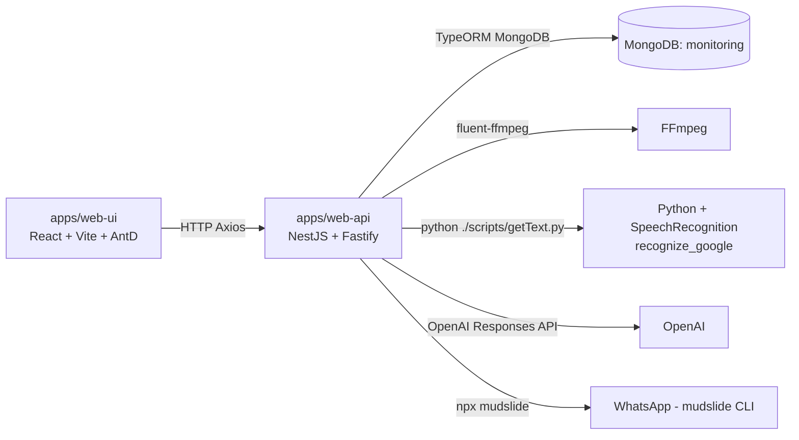

# Radio Alert — Documentación técnica (estado actual)

Esta documentación describe **qué hace hoy** el monorepo `radio-alert`, cómo están conectados sus componentes y cuáles son los flujos principales.

## 1) Panorama general

Este repo es un **monorepo PNPM/Turborepo** con:

- **Backend**: `apps/web-api` — API en **NestJS** usando **Fastify**.
- **Frontend**: `apps/web-ui` — UI en **React + Vite** con **Ant Design / Pro Layout**.
- **Shared**: `packages/shared` — DTOs (contratos) y helpers compartidos (fechas / transformaciones de texto).

## 2) Arquitectura y dependencias externas

### Bases de datos

En `apps/web-api/src/app/app.module.ts` se usa **una sola conexión Mongo**:

- **`monitoring`**: guarda `Alert`, `Note`, `Transcription` y `Platform` (plataformas/slots).

### Audio

El backend genera audios en `./audioFiles/`:

- `segment_<alertId>.mp3`: segmento largo (por defecto 1800s) alrededor del evento.
- `fragment_<alertId>.mp3` y `fragment_<alertId>.wav`: fragmento elegido por el usuario (para escuchar / transcribir).

La extracción y conversión se hace con **ffmpeg** vía `fluent-ffmpeg`.

### Transcripción

La transcripción usada por el flujo principal **se ejecuta con Python**:

- Node ejecuta: `python ./scripts/getText.py "<chunkPath>"`
- `getText.py` usa `speech_recognition` y `recognize_google(..., language='es-CO')`.

Además hay scripts alternativos con `faster_whisper` en `apps/web-api/scripts/getTranscription.py` y `scripts/getTranscription.py`, pero **no están conectados al flujo actual** (según el código).

### Resumen (IA)

El backend genera título + resumen con **OpenAI** en `apps/web-api/src/app/alerts/alerts.service.ts` usando `openai.responses.create()`.

## 3) Flujo funcional principal (end-to-end)

El flujo principal visible en la UI está en `apps/web-ui/src/pages/alerts`:

1. **Listar alertas**
   - UI llama `POST /alerts/dates` para obtener rango válido de fechas.
   - UI llama `POST /alerts` con `{ startDate, endDate, type: [...] }`.

2. **Abrir una alerta (modal por pasos)**
   - Paso “Editar Audio”: UI llama `POST /audio/createFile` para crear `segment_<id>.mp3`.
   - El usuario selecciona un rango sobre la forma de onda.

3. **Crear fragmento**
   - UI llama `POST /audio/createFile` para crear `fragment_<id>.mp3` y `fragment_<id>.wav`.

4. **Transcribir**
   - UI llama `POST /alerts/getText` con `{ filename: "fragment_<id>.wav" }`.
   - API divide en chunks de 60s, transcribe cada chunk en paralelo (Python), concatena texto y lo guarda/actualiza en `Note` (colección `note`).

5. **Resumir**
   - UI llama `POST /alerts/getSummary` con `{ noteId, text, words }`.
   - API pide a OpenAI un título y un resumen (máx. ~120 palabras), y actualiza el `Note` con `title` y `summary`.

6. **Completar metadatos de la nota**
   - UI consulta `GET /settings/get-platforms/:media` para inferir “Programa” y `audioLabel` a partir de “slots”.
   - Usuario completa: `index`, `program`, `title`, `summary`.

7. **Guardar nota**
   - UI llama `POST /notes/set-note` (actualiza `Note` y genera el campo `message`).

8. **Enviar por WhatsApp**
   - UI llama `POST /notes/send-note`.
   - API envía:
     - Un **mensaje** (texto) y
     - Un **audio** `./audioFiles/fragment_<alert_id>.mp3`
       usando `npx mudslide ...` (ver limitaciones abajo).

## 4) Contratos API (resumen)

### `POST /alerts`

- Request: `GetAlertsDto` (`packages/shared/models/alerts.dto.ts`)
  - `startDate`, `endDate` (YYYY-MM-DD)
  - `clientName` (opcional)
  - `type` (opcional: array)
- Response: `AlertDto[]`

### `POST /alerts/dates`

- Request: `Partial<GetAlertsDto>` (hoy se llama con `{}`)
- Response: `ValidDatesDto` `{ minDate, maxDate }`

### `POST /audio/createFile`

- Request: `CreateFileDto`
  - `output` debe incluir `segment_` o `fragment_`
  - `duration` y, para fragment: `startSecond`
  - `alert` (incluye `filePath`, `endTime`, etc.)
- Response: `{ startSeconds, duration }`

### `GET /audio/fetchByName/:filename`

- Devuelve `audio/mpeg` desde `./audioFiles/<filename>.mp3`.

### `POST /alerts/getText`

- Request: `GetTranscriptionDto` `{ filename }` (ej: `fragment_<id>.wav`)
- Response: `TranscriptionDto` `{ noteId, text }`

### `POST /alerts/getSummary`

- Request: `GetSummaryDto` `{ noteId, text, words }`
- Response: `SummaryDto` `{ title, summary }`

### `POST /notes/set-note`

- Request/Response: `NoteDto`
  - Genera/actualiza el campo `message`.

### `POST /notes/send-note`

- Request: `NoteDto` (usa `note.message` y `note.alert_id`)
- Response: `true | error`

### `GET /settings/get-platforms/:media`

- Response: `Platform[]` (entidad Mongo)

### `POST /settings/update-platform`

- Request: `PlatformDto`
- Response: `Platform`

## 5) Variables de entorno y configuración

### Backend (`apps/web-api`)

- `MONGODB_URI` (ej: `mongodb://localhost:27017`) — se le concatena `/monitoring` o `/config`.
- `BACK_PORT` (ej: `3001`) — puerto de API.
- `OPEN_AI_KEY` — API key para OpenAI.

Archivo guía: `apps/web-api/.env.example` (copiar a `apps/web-api/.env`).

### Frontend (`apps/web-ui`)

- `VITE_API_LOCAL` — base URL del backend (ej: `http://localhost:3001`).
- `VITE_PORT` — puerto de Vite (por defecto 4200).

Archivo guía: `apps/web-ui/.env.example` (copiar a `apps/web-ui/.env`).

## 6) Cómo correr en local (baseline)

- Instalar deps: `pnpm install`
- Crear envs: copiar `apps/web-api/.env.example` a `apps/web-api/.env` y `apps/web-ui/.env.example` a `apps/web-ui/.env`.
- Backend (dev): `pnpm --filter web-api dev`
- Frontend (dev): `pnpm --filter web-ui dev`

Alternativa “todo junto” (según `package.json` raíz):

- `pnpm start` (API en `BACK_PORT=3001` + UI en preview `4300`).

## 7) Limitaciones/alertas importantes (estado actual)

- **Transcripción**: usa `speech_recognition`/`recognize_google` (servicio online). Puede fallar por cuota, red o cambios del proveedor.
- **Concurrencia**: `getText()` transcribe todos los chunks con `Promise.all` sin límite; en audios largos puede saturar CPU/red.
- **WhatsApp**: `NotesService` usa un path fijo de Windows para `npx` (`C:\Program Files\nodejs\npx.cmd`) y un número hardcodeado (`573154421610`). Esto no es portable.
- **FFmpeg**: `fluent-ffmpeg` requiere que exista ffmpeg (en PATH o configurado). El repo tiene `ffmpeg-static` en el root, pero el backend no lo configura explícitamente.
- **Persistencia de notas**: el código mezcla `id` (TypeORM) con `_id` (Mongo ObjectId) en distintos lugares; si aparecen problemas de update/lookup, revisar esa consistencia.
- **Migración de Platforms**: si ya existían plataformas en la DB anterior `config`, hay que copiarlas/migrarlas a `monitoring` para que `GET /settings/get-platforms/:media` siga devolviendo datos.

---

Si querés, en el siguiente paso puedo:

- generar un `docs/ENDPOINTS.md` más detallado (requests/responses con ejemplos JSON), o
- inventariar “qué scripts/deps sobran/no se usan” para limpiar, o
- armar un diagrama de secuencia por cada caso de uso.
